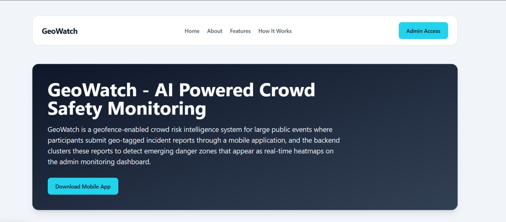
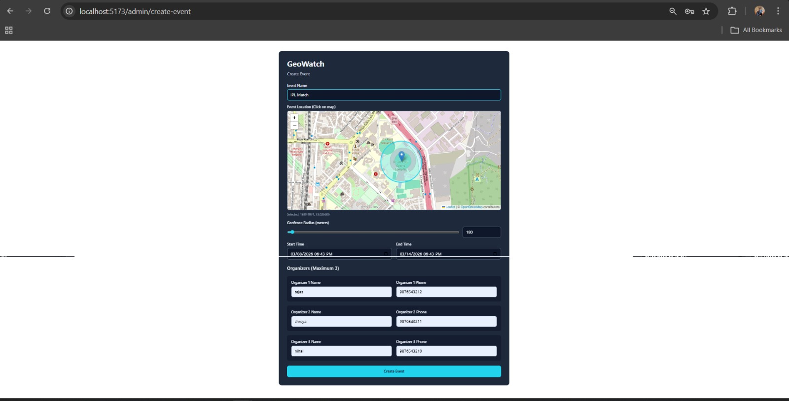
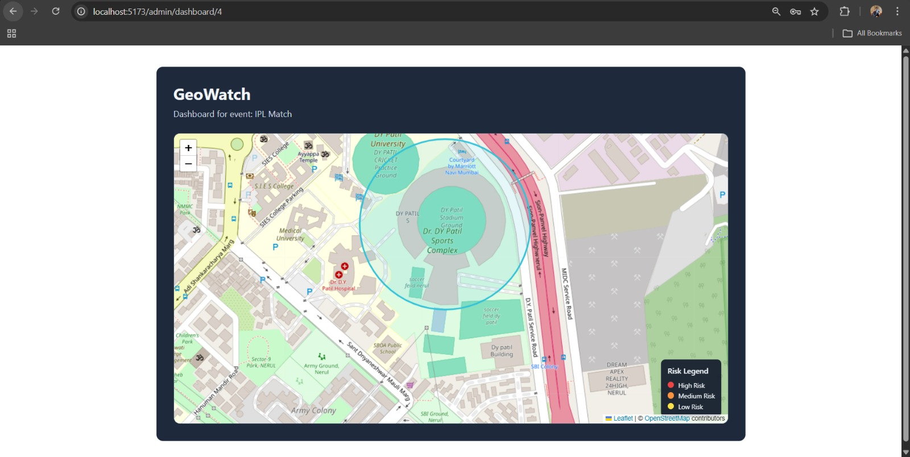
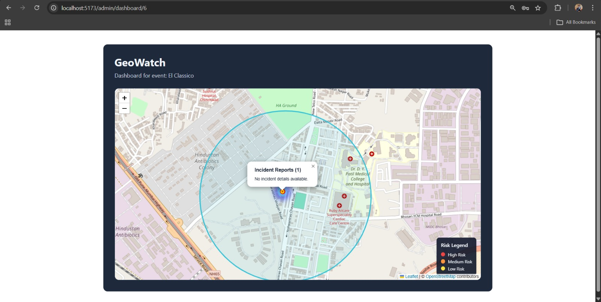

## GeoWatch – Project Overview

GeoWatch is a real-time crowd safety monitoring platform designed for large public events.  
Participants report incidents through a mobile application, while administrators monitor evolving risk zones through a live dashboard.

The system transforms raw incident reports into **geospatial clusters and risk levels**, allowing organizers to quickly identify dangerous crowd areas and respond faster.

---

## Core Idea

Large events often generate scattered incident reports that are difficult to interpret individually.  
GeoWatch aggregates these reports and applies **geospatial clustering** to detect emerging risk zones in real time.

---

## Key Features

- **Real Time Incident Reporting**
  - Participants submit SOS alerts with live GPS coordinates.

- **Event Geofencing**
  - Incidents are validated to ensure they occur inside the event boundary.

- **Risk Zone Detection**
  - DBSCAN clustering groups nearby incidents into clusters.

- **Risk Classification**
  - Clusters are categorized as **LOW, MEDIUM, or HIGH risk**.

- **Live Dashboard**
  - Admins monitor safety zones through a map-based interface.

- **WebSocket Updates**
  - Incident clusters update instantly without refreshing the dashboard.

---

## System Components

| Component | Description |
|----------|-------------|
| **Mobile App** | Flutter application used by participants to report incident |
| **Backend API** | Spring Boot service handling incident ingestion, clustering, and broadcasting |
| **Admin Dashboard** | React web application for monitoring crowd safety in real time |
| **Database** | PostgreSQL storing events, incidents, organizers, and admins |
| **Realtime Engine** | WebSocket + STOMP broadcasting cluster updates |

---

## How the System Works

1. Participants discover nearby events using GPS.
2. A participant submits an **SOS incident report**.
3. The backend validates the report and stores it in the database.
4. The system recalculates **incident clusters using DBSCAN**.
5. Updated risk zones are pushed to the admin dashboard via **WebSockets**.
6. Organizers see **live heatmaps and cluster markers** on the event map.

---

## System Interface Screenshots

### Home Page

*Figure 1: GeoWatch home page where users can view available events and access the reporting interface.*

---

### Event Creation Page

*Figure 2: Admin interface used to create and configure a new event with location and event details.*

---

### Event Map (Initial State)

*Figure 3: Admin dashboard displaying the event map before any incidents are reported.*

---

### Heatmap Visualization

*Figure 4: Real-time heatmap generated from clustered incidents showing potential risk zones.*

---

## Technologies Used

| Layer | Technology |
|------|-------------|
| Mobile | Flutter |
| Frontend | React + TypeScript |
| Backend | Spring Boot |
| Database | PostgreSQL |
| Mapping | Leaflet |
| Realtime Communication | WebSocket + STOMP |
| Clustering Algorithm | DBSCAN |
| Geospatial Calculations | Haversine Formula |

---

## Practical Impact

GeoWatch can significantly improve safety management during crowded events by providing real-time situational awareness.

Potential real-world applications include:

- **Concerts and Festivals**
  - Quickly identify dangerous crowd zones or emergencies.

- **College Festivals and Hackathons**
  - Monitor large campus gatherings and respond to incidents faster.

- **Sports Events**
  - Detect crowd disturbances or medical emergencies.

- **Public Gatherings and Rallies**
  - Assist organizers and authorities in monitoring crowd safety.

- **Smart City Safety Systems**
  - Integrate with city surveillance systems for proactive crowd risk detection.

By converting scattered reports into **live geospatial risk intelligence**, GeoWatch enables organizers and authorities to take **faster, data-driven safety actions**.

---

## What GeoWatch Achieves

GeoWatch converts scattered incident reports into **real-time geospatial risk intelligence**, helping event organizers detect danger zones early and improve crowd safety response.
